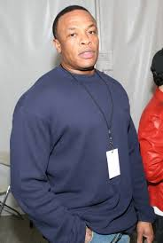
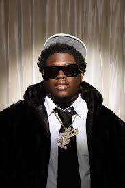
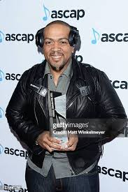

<!DOCTYPE html>
<html lang="en">
<head>
    <meta charset="UTF-8">
    <meta name="viewport" content="width=device-width, initial-scale=1.0">
    <title>Engineering Thru Beats: Exploring Music Engineering</title>
    <link href="https://fonts.googleapis.com/css2?family=Bangers&family=Permanent+Marker&family=Press+Start+2P&family=Russo+One&family=Special+Elite&display=swap" rel="stylesheet">
    
</head>
<body>
    <header>
        

            Engineering Thru Beats
        

    </header>

    <nav>
        <ul>
            <li><a href="#intro">Intro</a></li>
            <li><a href="#aspects">Key Aspects</a></li>
            <li><a href="#beatpad">Beat Pad</a></li>
            <li><a href="#careers">Careers</a></li>
            <li><a href="#testimonials">Testimonials</a></li>
            <li><a href="why-beats.html">Why Beats?</a></li>
        </ul>
    </nav>

    <main class="container">
        <section id="intro">
            <h2>Welcome to the World of Music Engineering</h2>
            
Explore the fascinating intersection of technology and creativity that shapes the soundtrack of our lives.

        </section>

        <section id="aspects">
            <h2>Key Aspects of Music Engineering</h2>
            

                

                    <h3>Recording</h3>
                    
Capture pristine audio using state-of-the-art equipment and techniques.

                

                

                    <h3>Mixing</h3>
                    
Blend multiple tracks into a cohesive and balanced sonic masterpiece.

                

                

                    <h3>Mastering</h3>
                    
Polish and prepare your tracks for distribution across various platforms.

                

                

                    <h3>Sound Design</h3>
                    
Create unique audio elements that bring productions to life.

                

            

        </section>

        <section id="beatpad">
            <h2>Create Your Own Beats</h2>
            
Ready to make some music? Try our interactive beat maker!

            <a href="beat_maker.html" class="cta-button">Launch Beat Maker</a>
            

                
Beat Pad Preview

            

        </section>

        <section id="careers">
            <h2>Careers in Music Production</h2>
            

                

                    
                    <h3 class="dr-dre">Dr. Dre</h3>
                    <ul class="dr-dre">
                        <li>Real Name: Andre Romelle Young</li>
                        <li>Started as: DJ in the 1980s</li>
                        <li>Known for: Pioneering West Coast G-funk</li>
                        <li>Notable Acts: N.W.A, Eminem, Snoop Dogg</li>
                        <li>Estimated Net Worth: $820 million</li>
                    </ul>
                

                

                    
                    <h3 class="benny-blanco">Benny Blanco</h3>
                    <ul class="benny-blanco">
                        <li>Real Name: Benjamin Joseph Levin</li>
                        <li>Started: Producing in his teens</li>
                        <li>Known for: Pop and hip-hop production</li>
                        <li>Notable Acts: Ed Sheeran, Justin Bieber, Maroon 5</li>
                        <li>Estimated Net Worth: $50 million</li>
                    </ul>
                

                

                    
                    <h3 class="metro-boomin">Metro Boomin</h3>
                    <ul class="metro-boomin">
                        <li>Real Name: Leland Tyler Wayne</li>
                        <li>Started: Producing at age 13</li>
                        <li>Known for: Trap music production</li>
                        <li>Notable Acts: Future, 21 Savage, The Weeknd</li>
                        <li>Estimated Net Worth: $16 million</li>
                    </ul>
                

                

                    
                    <h3 class="cash-cobain">Cash Cobain</h3>
                    <ul class="cash-cobain">
                        <li>Known as: "The Sample God"</li>
                        <li>Started: In the New York drill scene</li>
                        <li>Known for: Innovative sampling in drill music</li>
                        <li>Notable Acts: Various NY drill artists</li>
                        <li>Estimated Net Worth: Not publicly available</li>
                    </ul>
                

                

                    
                    <h3 class="timbaland">Timbaland</h3>
                    <ul class="timbaland">
                        <li>Real Name: Timothy Zachary Mosley</li>
                        <li>Started: As part of production duo S.B.I.</li>
                        <li>Known for: Innovative rhythm and sound design</li>
                        <li>Notable Acts: Missy Elliott, Justin Timberlake, Aaliyah</li>
                        <li>Estimated Net Worth: $85 million</li>
                    </ul>
                

                

                    <h3>General Career Info</h3>
                    
Music Producer Salary Range: $25,000 - $1,000,000+

                    
Education: Degree in Music Production or Business can open doors to higher-paying opportunities

                

            

        </section>

        <section id="testimonials">
            <h2>What the Pros Say</h2>
            

                
"The most important thing is to be true to yourself and make music that you love."

                <cite>- Dr. Dre</cite>
            

            

                
"Don't be afraid to experiment. Some of the best sounds come from happy accidents."

                <cite>- Benny Blanco</cite>
            

            

                
"If you want to be a producer, you gotta make at least five beats a day for three summers."

                <cite>- Metro Boomin</cite>
            

            

                
"Sampling is an art form. It's about finding that perfect sound and flipping it into something new."

                <cite>- Cash Cobain</cite>
            

            

                
"To make it in this industry, you need to have your own sound. Be innovative and push boundaries."

                <cite>- Timbaland</cite>
            

            

                
"Engineering isn't just about technicality; it's about translating emotion into sound."

                <cite>- Alex Turner, Platinum Record Producer</cite>
            

            

                
"My engineering degree gave me the edge in understanding both the art and science of music production."

                <cite>- Samantha Lee, Grammy-nominated Engineer</cite>
            

        </section>
    </main>

    <footer>
        
&copy; 2024 Engineering Thru Beats. All rights reserved.

    </footer>

    
</body>
</html>
